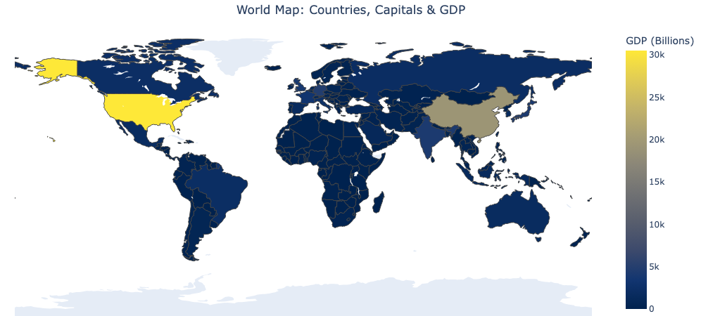
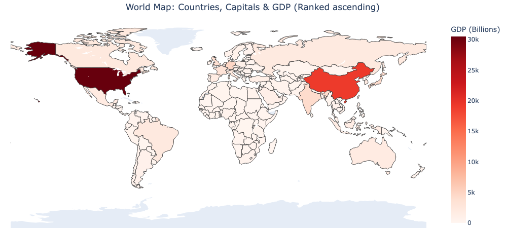

# QuizVerse

A comprehensive learning platform built with Dash and Plotly, featuring interactive world map exploration and diverse quiz categories including geography, history, science, and sports.

## Features

- **Interactive World Map**: Visualize country data with hover information
- **GDP Visualization**: High/Low GDP country highlighting
- **Geography Challenge**: Multiple quiz types including:
  - Capital cities
  - Currencies
  - Continents
  - Mixed country knowledge

## Prerequisites

- **For Docker**: Docker installed on your system
- **For Local Development**: Python 3.13+ and [uv](https://docs.astral.sh/uv/) package manager

## Installation & Setup

### Option 1: Using Docker (Recommended)

#### Step 1: Clone the Repository
```bash
git clone <repository-url>
cd interactiveMap
```

#### Step 2: Build the Docker Image
```bash
docker build -t interactive-map .
```

#### Step 3: Run the Docker Container
```bash
docker run -p 8050:8050 interactive-map
```

#### Step 4: Access the Application
Open your browser and navigate to: http://localhost:8050

### Option 2: Using UV (Local Development)

#### Step 1: Install UV
If you don't have uv installed, install it first:
```bash
# On macOS/Linux
curl -LsSf https://astral.sh/uv/install.sh | sh

# On Windows
powershell -c "irm https://astral.sh/uv/install.ps1 | iex"

# Or using pip
pip install uv
```

#### Step 2: Clone the Repository
```bash
git clone <repository-url>
cd interactiveMap
```

#### Step 3: Sync Dependencies
```bash
uv sync
```

#### Step 4: Run the Application
```bash
uv run app.py
```

#### Step 5: Access the Application
Open your browser and navigate to: http://127.0.0.1:8050

## Docker Details

### Multi-stage Build
The Dockerfile uses a multi-stage build process for optimal image size:
- **Builder stage**: Installs uv and dependencies
- **Runtime stage**: Contains only the application and its dependencies

### Key Docker Features
- Uses Python 3.13 slim base image
- Leverages uv for fast dependency management
- Implements build caching for faster rebuilds
- Optimized for production deployment

### Docker Commands Reference

```bash
# Build the image
docker build -t interactive-map .

# Run with port mapping
docker run -p 8050:8050 interactive-map

# Run in detached mode
docker run -d -p 8050:8050 --name my-interactive-map interactive-map

# View running containers
docker ps

# Stop the container
docker stop my-interactive-map

# Remove the container
docker rm my-interactive-map

# View logs
docker logs my-interactive-map
```

## Project Structure

```
interactiveMap/
├── app.py                 # Main application entry point
├── Dockerfile            # Docker configuration
├── pyproject.toml        # Project dependencies and metadata
├── uv.lock              # Locked dependency versions
├── components/          # Reusable UI components
├── pages/              # Application pages
│   ├── explore.py      # Interactive map page
│   └── trivia/         # Trivia quiz modules
├── utils/              # Utility functions
├── data/               # Data files
└── pictures/           # Application screenshots
```

## Application Screenshots

### Interactive World Map


### Low GDP Countries


### High GDP Countries


## Development

### Adding New Dependencies
```bash
# Add a new dependency
uv add package-name

# Add a development dependency
uv add --dev package-name

# Update dependencies
uv sync
```

### Running Tests
```bash
# Run tests (when available)
uv run pytest
```

## Troubleshooting

### Common Issues

**Port Already in Use**
```bash
# Kill process using port 8050
lsof -ti:8050 | xargs kill -9

# Or use a different port
docker run -p 8051:8050 interactive-map
```

**Docker Build Issues**
```bash
# Clear Docker cache
docker system prune -a

# Rebuild without cache
docker build --no-cache -t interactive-map .
```

**UV Sync Issues**
```bash
# Clear UV cache
uv cache clean

# Force sync
uv sync --refresh
```

## Configuration

The application runs on port 8050 by default. You can modify this in `app.py`:

```python
if __name__ == '__main__':
    app.run_server(debug=True, host='0.0.0.0', port=8050)
```

## Contributing

1. Fork the repository
2. Create a feature branch (`git checkout -b feature/amazing-feature`)
3. Commit your changes (`git commit -m 'Add some amazing feature'`)
4. Push to the branch (`git push origin feature/amazing-feature`)
5. Open a Pull Request

## License

This project is licensed under the MIT License - see the [LICENSE](LICENSE) file for details.
