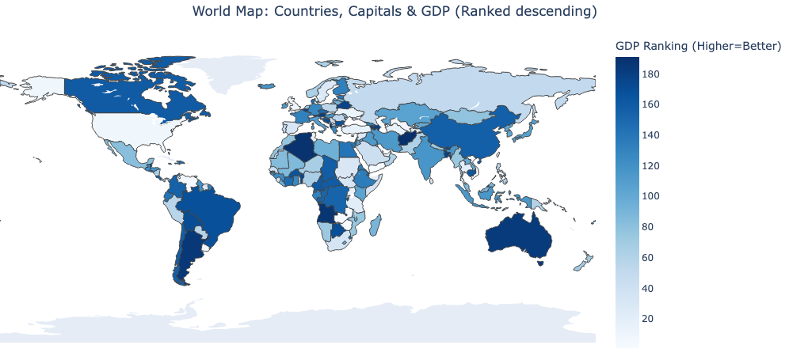

# QuizVerse

A comprehensive learning platform built with Dash and Plotly, featuring interactive world map exploration, diverse quiz categories, and advanced analytics for tracking learning progress.

## Features

### Core Features
- **Interactive World Map**: Visualize country data with hover information and GDP highlighting
- **Comprehensive Quiz System**: Multiple quiz categories with session tracking and analytics
- **Analytics Dashboard**: Advanced performance tracking with charts, leaderboards, and statistics
- **User Management**: Username support with personalized quiz sessions
- **Database-Driven**: Normalized SQLite database with efficient data management

### Quiz Categories

#### Geography Quizzes
Complete geography challenges with 8 quiz types:
- **Physical Geography**: Landscapes, mountain ranges, natural features
- **World Flags**: Match flags with countries
- **Currencies**: Match countries with their currencies  
- **World Capitals**: Match countries with capital cities
- **Continents**: Match countries with their continents
- **India State Capitals**: Match Indian states with capitals
- **US State Capitals**: Match US states with capitals
- **Wonders**: Famous landmarks and natural wonders

#### Mathematics Quizzes
- **K-5 Math**: Elementary mathematics questions covering basic arithmetic

#### Coming Soon
- **History Quizzes**: Historical events, figures, and timelines
- **Science Quizzes**: Physics, chemistry, biology, and general science
- **Sports Quizzes**: Sports facts, records, and trivia

### Analytics & Performance Tracking

#### Dashboard Features
- **📊 Real-time Analytics**: Live performance tracking and statistics
- **📈 Daily Performance Trends**: Track progress over time with interactive charts
- **📚 Category Performance**: Compare accuracy across different quiz categories
- **🕐 Recent Sessions**: Monitor latest quiz attempts with detailed information
- **🔥 Trending Questions**: Identify most challenging and popular questions
- **🏆 Leaderboards**: Session rankings based on accuracy and speed

#### Statistics Tracked
- **Question-Level Stats**: Times asked, accuracy rates, response times
- **Daily Aggregations**: Questions answered, overall accuracy, average response time
- **Session Analytics**: Complete session tracking with user identification
- **Category Performance**: Performance breakdown by quiz category
- **Historical Data**: Weekly rollover with long-term trend analysis

### Technical Features

#### Database & Storage
- **Normalized SQLite Database**: Efficient relational structure with proper foreign keys
- **UTC Timestamp Storage**: Consistent timezone handling with local display conversion
- **Automated Rollover**: Weekly aggregation of statistics with cleanup of old data
- **Session Management**: Complete quiz session lifecycle tracking

#### User Experience
- **Responsive Design**: Clean, modern interface with CSS-based styling
- **Username Support**: Personalized quiz sessions with user identification
- **Progress Tracking**: Real-time progress bars and session feedback
- **Timezone Awareness**: UTC storage with local timezone display
- **Auto-refresh**: Live updating analytics dashboard

## Prerequisites

- **For Docker**: Docker installed on your system
- **For Local Development**: Python 3.13+ and [uv](https://docs.astral.sh/uv/) package manager

## Installation & Setup

### Option 1: Using Docker (Recommended)

#### Step 1: Clone the Repository
```bash
git clone <repository-url>
cd interactiveMap
```

#### Step 2: Build the Docker Image
```bash
docker build -t interactive-map .
```

#### Step 3: Run the Docker Container
```bash
docker run -p 8050:8050 interactive-map
```

#### Step 4: Access the Application
Open your browser and navigate to: http://localhost:8050

### Option 2: Using UV (Local Development)

#### Step 1: Install UV
If you don't have uv installed, install it first:
```bash
# On macOS/Linux
curl -LsSf https://astral.sh/uv/install.sh | sh

# On Windows
powershell -c "irm https://astral.sh/uv/install.ps1 | iex"

# Or using pip
pip install uv
```

#### Step 2: Clone the Repository
```bash
git clone <repository-url>
cd interactiveMap
```

#### Step 3: Sync Dependencies
```bash
uv sync
```

#### Step 4: Run the Application
```bash
uv run app.py
```

#### Step 5: Access the Application
Open your browser and navigate to: http://127.0.0.1:8050

## Usage Guide

### Taking Quizzes
1. **Navigate** to any quiz category from the navigation bar
2. **Enter Username** when prompted (or use anonymous mode)
3. **Select Quiz Type** from the available options
4. **Answer Questions** with immediate feedback and explanations
5. **View Results** with detailed performance breakdown
6. **Restart or Return** to try different quizzes

### Analytics Dashboard
1. **Access Analytics** from the navigation menu
2. **View Today's Stats** in the summary cards
3. **Explore Charts** for performance trends and category comparisons
4. **Check Tables** for recent sessions, trending questions, and leaderboards
5. **Filter Date Range** to analyze specific time periods
6. **Auto-Refresh** for real-time updates

### Database Management
The application includes utilities for database management:
- **Database Creation**: Automated normalized database setup
- **Data Import**: CSV to SQLite conversion utilities
- **Cleanup Tools**: Remove old data and optimize performance
- **Statistics Rollover**: Weekly aggregation for long-term analysis

## Project Structure

```
interactiveMap/
├── app.py                 # Main application entry point
├── Dockerfile            # Docker configuration
├── pyproject.toml        # Project dependencies and metadata
├── uv.lock              # Locked dependency versions
├── components/          # Reusable UI components
│   └── navbar.py        # Navigation bar component
├── pages/              # Application pages
│   ├── explore/        # Interactive map functionality
│   ├── analytics/      # Analytics dashboard
│   ├── geography/      # Geography quiz pages
│   ├── mathematics/    # Mathematics quiz pages
│   ├── trivia/         # Core quiz functionality
│   ├── history/        # History quiz pages (coming soon)
│   ├── science/        # Science quiz pages (coming soon)
│   └── sports/         # Sports quiz pages (coming soon)
├── utils/              # Utility functions
│   ├── database_utils.py    # Database connection and utilities
│   ├── quiz_generators.py   # Quiz question generation
│   ├── quiz_stats.py       # Statistics management
│   ├── datetime_utils.py   # Timezone conversion utilities
│   └── data_processing.py  # Data processing utilities
├── assets/            # Static assets
│   ├── styles.css     # Application styling
│   └── flags/         # Country flag images
├── data/              # Data files and database
│   ├── quiz_database.db    # Main SQLite database
│   ├── countries.csv       # Country data
│   ├── us.csv             # US states data
│   ├── india.csv          # India states data
│   ├── math.csv           # Mathematics questions
│   └── world_physical_geography.csv  # Physical geography data
└── pictures/          # Application screenshots
```

## Database Schema

### Core Tables
- **categories**: Quiz categories (Geography, Mathematics, etc.)
- **subcategories**: Quiz subcategories (Flags, Capitals, etc.)
- **questions_normalized**: All quiz questions with relationships
- **daily_question_stats**: Daily question performance statistics
- **daily_category_stats**: Daily category performance statistics
- **quiz_sessions**: Individual quiz answers
- **session_stats**: Session-level statistics and metadata
- **historical_question_stats**: Weekly aggregated historical data

### Key Features
- **Normalized Structure**: Proper foreign key relationships
- **UTC Timestamps**: Consistent timezone handling
- **Automatic Rollover**: Weekly statistical aggregation
- **Performance Optimized**: Indexed for fast queries

## Application Screenshots

### Interactive World Map


### Low GDP Countries


### High GDP Countries


## Development

### Adding New Quiz Categories
1. Create page module in `pages/[category]/`
2. Add quiz questions to appropriate CSV file
3. Update database schema if needed
4. Register callbacks and layouts
5. Add navigation menu item

### Adding New Dependencies
```bash
# Add a new dependency
uv add package-name

# Add a development dependency
uv add --dev package-name

# Update dependencies
uv sync
```

### Database Operations
```bash
# Create normalized database
uv run create_normalized_database.py

# Import CSV data
uv run utils/csv_to_sqlite.py

# Test database integration
uv run test_database_integration.py

# Cleanup old data
uv run cleanup_old_tables.py
```

### Running Tests
```bash
# Run tests (when available)
uv run pytest
```

## API Reference

### Quiz Statistics Manager
```python
from utils.quiz_stats import QuizStatsManager

stats = QuizStatsManager()

# Start a quiz session
session_id = stats.start_quiz_session(
    session_name="Geography Quiz",
    user_id="john_doe"
)

# Record quiz answers
stats.record_quiz_answer_with_session(
    session_id=session_id,
    question_id=123,
    is_correct=True,
    response_time=5.2,
    user_answer="Paris"
)

# End session and get final stats
final_stats = stats.end_quiz_session(session_id)
```

### Quiz Generators
```python
from utils.quiz_generators import get_quiz_questions

# Get geography questions
questions = get_quiz_questions('flag', None, 10)

# Get math questions
from utils.math_quiz_generators import get_math_quiz_questions
math_questions = get_math_quiz_questions('k5_math', None, 10)
```

## Troubleshooting

### Common Issues

**Port Already in Use**
```bash
# Kill process using port 8050
lsof -ti:8050 | xargs kill -9

# Or use a different port
docker run -p 8051:8050 interactive-map
```

**Docker Build Issues**
```bash
# Clear Docker cache
docker system prune -a

# Rebuild without cache
docker build --no-cache -t interactive-map .
```

**UV Sync Issues**
```bash
# Clear UV cache
uv cache clean

# Force sync
uv sync --refresh
```

**Database Issues**
```bash
# Recreate database
uv run create_normalized_database.py

# Check database schema
uv run examine_database_schema.py
```

**Analytics Not Updating**
- Check database permissions
- Verify UTC timezone handling
- Clear browser cache
- Restart application

## Performance Optimization

### Database Performance
- **Automatic Cleanup**: Old session data removed weekly
- **Indexed Queries**: Optimized for fast statistics retrieval
- **Batch Operations**: Efficient bulk data processing

### Application Performance
- **CSS Classes**: Eliminated inline styles for better performance
- **Component Reuse**: Modular component architecture
- **Lazy Loading**: Components loaded as needed

## Configuration

### Application Settings
```python
# app.py
if __name__ == '__main__':
    app.run_server(
        debug=True,        # Set to False in production
        host='0.0.0.0',   # Allow external connections
        port=8050         # Default port
    )
```

### Database Configuration
```python
# utils/quiz_stats.py
class QuizStatsManager:
    def __init__(self, db_path: str = "data/quiz_database.db"):
        self.db_path = db_path  # Customize database location
```

### Analytics Settings
- **Auto-refresh Interval**: 30 seconds (configurable in layouts)
- **Data Retention**: 30 days for daily stats, 7 days for sessions
- **Chart Limits**: Configurable limits for trending questions and leaderboards

## Contributing

1. Fork the repository
2. Create a feature branch (`git checkout -b feature/amazing-feature`)
3. Commit your changes (`git commit -m 'Add some amazing feature'`)
4. Push to the branch (`git push origin feature/amazing-feature`)
5. Open a Pull Request

### Contribution Guidelines
- Follow existing code style and structure
- Add tests for new functionality
- Update documentation for new features
- Ensure timezone handling for any datetime operations
- Use normalized database structure for new data

## License

This project is licensed under the MIT License - see the [LICENSE](LICENSE) file for details.

## Changelog

### Recent Updates
- **Analytics Dashboard**: Comprehensive performance tracking with charts and leaderboards
- **Mathematics Quizzes**: Added K-5 math category with elementary arithmetic
- **Database Normalization**: Migrated to efficient relational database structure
- **Username Support**: Personalized quiz sessions with user identification
- **Session Tracking**: Complete quiz session lifecycle management
- **Timezone Handling**: UTC storage with local timezone display
- **Enhanced UI**: CSS refactoring and improved user experience
- **Statistics System**: Daily tracking with weekly rollover functionality
- **Performance Optimization**: Improved database queries and component efficiency
